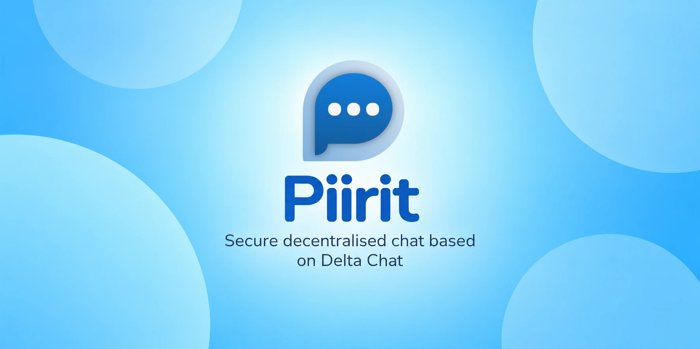

# Piirit



[](https://sonarcloud.io/summary/new_code?id=muhnschein_piirit)[](https://sonarcloud.io/summary/new_code?id=muhnschein_piirit)[](https://sonarcloud.io/summary/new_code?id=muhnschein_piirit)[](https://sonarcloud.io/summary/new_code?id=muhnschein_piirit)

> 🤖 **This project was developed using AI.** If that provenance troubles
> you, feel free to use something else. That being said, this is largely a
> GUI wrapper around an [excellent core](https://github.com/chatmail/core) from the upstream Delta Chat project.
>
> 📱 **Modern SailfishOS-only:** Piirit currently targets the 
> Jolla Phone 2026 and nothing else. No effort is made to accommodate older
> targets. [Buy a Jolla Phone 2026](https://commerce.jolla.com/) and support
> European-made alternatives. 👊🇪🇺🔥

## Overview

Piirit is a Silica/QML application built on top of the [Delta Chat core](https://github.com/chatmail/core).

It implements no messaging protocol of its own. Every piece of
IMAP/SMTP/MIME/crypto logic lives in upstream's `deltachat-rpc-server`, which
Piirit spawns as a subprocess and drives over JSON-RPC on stdio. Piirit
itself *never* touches a mail server or a key.

## Limitations

- No protocol or crypto reimplementation — ever. We never roll our own crypto.
- Chats via regular email or any non-chatmail servers.
- Video calls. Voice calls are experimental and off until switched on in
  the settings — see [`docs/CALLS.md`](docs/CALLS.md) for what is built and
  what only a phone can confirm.
- No OpenRepos/Chum.

See the non-goals in [`docs/PROJECT.md`](docs/PROJECT.md) for more information.

## Documentation

- [`docs/PROJECT.md`](docs/PROJECT.md) — project scope and explicit non-goals,
 and what is missing
- [`docs/BUILDING.md`](docs/BUILDING.md) — engineering standards, testing, and
how a device RPM is built
- [`docs/HARBOUR.md`](docs/HARBOUR.md) — our understanding of Jolla's store 
rules, how CI tries to gate them, and the two that still block submission
- [`docs/CALLS.md`](docs/CALLS.md) — how a call works here, how much of
the phone's own call handling an app can have, and what is still unproven

## Building

Device packages need the Sailfish SDK with the **Docker** build engine — the
VirtualBox one cannot compile Rust — and a build target for your device's
architecture.

```
$ git clone https://github.com/muhnschein/piirit.git
$ cd piirit
$ scripts/fetch-rpc-server.sh     # bundled deltachat-rpc-server binaries
$ scripts/build-rpm.sh aarch64    # or: armv7hl; add a version, e.g. 5.2.0.15
```

Everything else needs no phone or account, and mostly no network (`msrv`
fetches a toolchain once, `deny` and `vendor-check` fetch what they
compare against):

```
# What CI runs, less the real-core integration tests: fmt, clippy, tests,
# qmllint, packaging and Harbour checks, licences and advisories.
$ make check

# Compile against Sailfish's Rust 1.75 floor.
$ make msrv
```

Host-side Qt5 requirements, the real-core integration tests,  and the 
toolchain floor are in [`docs/BUILDING.md`](docs/BUILDING.md).

## Attributions

* [Delta Chat](https://delta.chat/), for building a rock-solid messenger 
  that is modern, secure, and standards-based - and for making all of that
  available in a handy, memory-safe [core library](https://github.com/chatmail/core).  
* [parla](https://github.com/trufae/parla), for building an excellent Delta
  Chat client. Piirit's settings, tracking protection (`links.rs`) are taken 
  from it. Its Markdown formatting (`markdown.rs`) and relay connectivity info
   (`connectivity.rs`) are modeled after it.
* [whisperfish](https://gitlab.com/whisperfish/whisperfish), for showing what's
  possible on Sailfish OS.

## License

Licensed GPLv3+, see the LICENSE file for details.

Copyright © Piirit contributors.